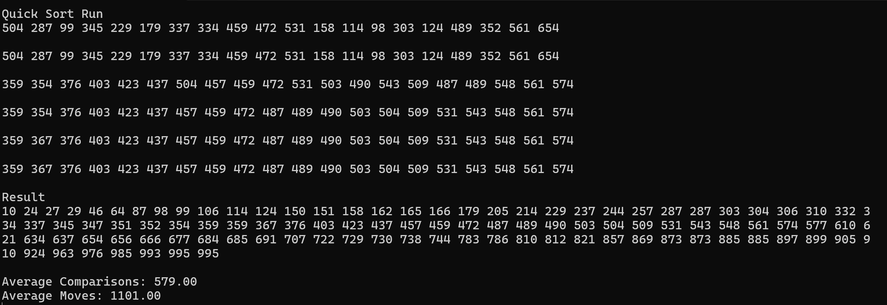

# QuickSort {Result Image}

선택정렬, 버블정렬은 모든 경우에 시간복잡도가 O(n^2)이다.(버블 정렬은 실험적으로 최선의 경우 O(n)으로 끝난다.)
삽입정렬은 최악과 평균의 경우 O(n^2), 최선의 경우는 O(n)이다.
쉘정렬은 최악과 평균의 경우 O(n^2), 최선의 경우는 O(n^(3/2))이다.
합병정렬은 모든 경우 O(nlogn)이다.
퀵정렬은 최선과 평균의 경우 O(nlogn), 최악의 경우 O(n^2)이다.
