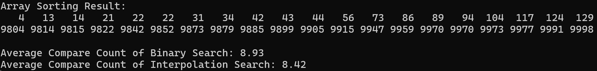

# InterpolationSearch {Result}

#  A, B, C에 대해서 퀵 정렬후의 이진탐색에서 순차탐색보다 적게 비교하는 이유를 설명   
정렬이 된 이진탐색은 탐색하고자 하는 값을 탐색할 때 가운데 인덱스의 값을 기준으로 하여 값이 작은지 큰지에 따라 왼쪽, 오른쪽 배열을 중심으로 그 과정을 반복한다. 따라서 탐색의 한 과정이 지날 때마다 배열이 반씩 줄어든다고 볼 수 있다. 하지만 순차탐색은 탐색하고자 하는 값과 배열을 하나하나씩 비교하는 과정을 거치기에 비교횟수가 이진탐색보다 더 많을 수밖에 없다.
