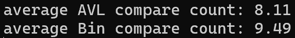
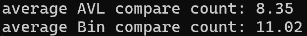

# compareAVL {Result Image}

# 이진 탐색 트리와 AVL에 대한 탐색의 비교횟수를 비교분석한 내용
AVL트리는 오른쪽, 왼쪽 서브트리의 균형을 맞추기 때문에 탐색할 때 거의 일정한 결과가 나온다. 그에 반해 이진 탐색 트리는 균형을 맞추지 않기 때문에 탐색을 할 때 트리의 모양이 결과에 큰 영향을 미친다.   
따라서 균형을 유지하는 AVL트리가 이진 탐색 트리보다 비교횟수 평균이 적게 나온다.   
